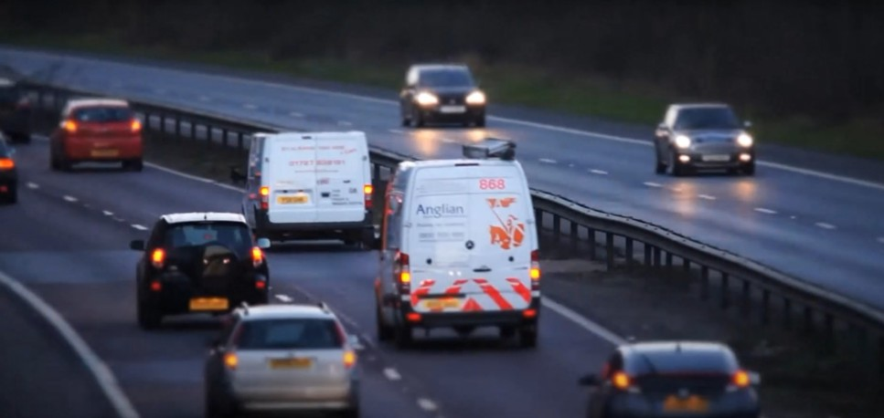

# Depth Estimation from Image using Transformers

This Python script performs **depth estimation** on a user-provided image using the [Depth Anything V2](https://huggingface.co/depth-anything/Depth-Anything-V2-base-hf) model via Hugging Face's `transformers` library. It supports both image URLs and local file paths and visualizes the original image alongside its depth prediction.

---

## Features

- Supports **depth estimation** using a pretrained model.
- Accepts input from either:
  - **Image URL** (remote web image), or
  - **Local image file path**.
- Visualizes:
  - The **original image**, and
  - The **predicted depth map** using a color map.
- Simple command-line interface for ease of use.

---

## Requirements

Before running the script, make sure to install the following Python packages:

```bash
pip install transformers torch pillow matplotlib requests
```

---

## Usage

Run the script using Python:

```bash
python depth_estimation.py
```

### You will be prompted to choose an input type:

- To use an image from the internet:
  ```
  Enter 'url' to provide an image URL or 'local' to provide a local file path: url
  Enter the image URL: https://example.com/image.jpg
  ```

- To use a local image file:
  ```
  Enter 'url' to provide an image URL or 'local' to provide a local file path: local
  Enter the local image file path: ./images/sample.jpg
  ```

Once an image is loaded, the script will:
1. Display the **original image**.
2. Run **depth estimation**.
3. Display the **predicted depth map** using the `inferno` colormap.

---

## Model Info

- **Checkpoint:** `depth-anything/Depth-Anything-V2-base-hf`
- **Task:** `depth-estimation`
- **Source:** [Hugging Face Model Hub](https://huggingface.co/depth-anything/Depth-Anything-V2-base-hf)

---

## Customization

- **Device:** Currently set to `"cuda"`, but you can switch to `"cpu"` if you have a compatible CPU.
  ```python
  pipe = pipeline("depth-estimation", model=checkpoint, device="cpu")
  ```

- **Image Output:** If you want to save the depth maps, you can extend the script using `plt.savefig()`.

---

## Example Outputs

| Input Image | Predicted Depth |
|-------------|-----------------|
|  |  |

---

## Note

This script provides a basic example to estimate the scene depth using pretrained Hugging Face Transformers model.